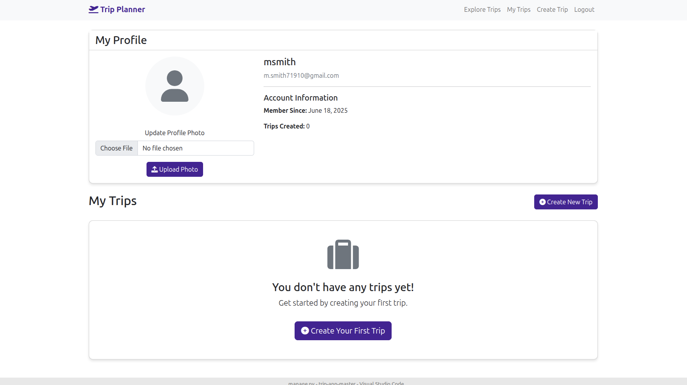

# 🌍 Trip Planner - Your Ultimate Travel Companion

[](https://www.djangoproject.com/)
[](https://www.python.org/)
[](https://getbootstrap.com/)
[](LICENSE)

A comprehensive Django web application for planning, organizing, and sharing your travel adventures. Create detailed trip itineraries, manage budgets, share photos, and connect with fellow travelers.



## ✨ Features

### 🗺️ **Trip Planning**
- Create detailed trip plans with dates, descriptions, and destinations
- Upload trip profile photos
- Organize trips by start and end dates
- **Support for both future and past trips** (travel memories)

### 📅 **Itinerary Management**
- Build day-by-day itineraries with specific times
- Add activities and locations for each day
- Organize events chronologically
- Edit and update itinerary items

### 💰 **Budget Tracking**
- Track expenses by category (Transportation, Accommodation, Food, Activities, etc.)
- Monitor total trip costs
- Add detailed descriptions for each expense
- Stay within your financial limits

### 📸 **Photo Sharing**
- Upload and share trip photos
- Add captions to your photos
- Comment on photos
- React to photos with emojis (Like, Love, Amazing, etc.)

### 👥 **Social Features**
- Explore trips from other travelers
- Comment on trips and photos
- React to content with various emotions
- Connect with the travel community

### 📄 **Export & Sharing**
- Download trip details as PDF
- Print-friendly trip summaries
- Share trip information easily

### 🔐 **User Management**
- Secure user registration with **terms and conditions acceptance**
- **Comprehensive user portfolios** with featured trips
- **Advanced privacy settings** (Public, Registered Users, Private)
- **Theme preferences** (Light, Dark, Auto mode)
- Personal trip dashboard and account management

### 🎨 **Modern UI/UX**
- **Beautiful gradient designs** with purple theme
- **Dark mode support** with automatic theme detection
- **Responsive design** that works on all devices
- **Smooth animations** and hover effects
- **Professional typography** and spacing
- **Card-based layouts** with modern styling

### 👤 **User Portfolio System**
- **Personal portfolio pages** showcasing travel experiences
- **Featured trips** selection (up to 3 trips)
- **Social media integration** (Instagram, Twitter, Facebook)
- **Bio and location** information
- **Privacy controls** for profile visibility

### ⚙️ **Advanced Settings**
- **Privacy controls** for profile, trips, and photos
- **Theme preferences** (Light, Dark, Auto)
- **Notification settings** for comments and reactions
- **Display options** for profile information
- **Featured trips management**

## 🚀 Quick Start

### Prerequisites

- Python 3.8 or higher
- pip (Python package installer)
- Virtual environment (recommended)

### Installation

1. **Clone the repository**
   ```bash
   git clone https://github.com/yourusername/trip-planner.git
   cd trip-planner
   ```

2. **Create and activate virtual environment**
   ```bash
   # On Windows
   python -m venv venv
   venv\Scripts\activate

   # On macOS/Linux
   python3 -m venv venv
   source venv/bin/activate
   ```

3. **Install dependencies**
   ```bash
   pip install -r requirements.txt
   ```

4. **Set up the database**
   ```bash
   python manage.py makemigrations
   python manage.py migrate
   ```

5. **Create a superuser (optional)**
   ```bash
   python manage.py createsuperuser
   ```

6. **Run the development server**
   ```bash
   python manage.py runserver
   ```

7. **Access the application**
   Open your browser and navigate to `http://127.0.0.1:8000`

## 📁 Project Structure

```
trip-app/
├── trip/                          # Main Django app
│   ├── migrations/               # Database migrations
│   ├── templates/trip/          # HTML templates
│   │   ├── index.html           # Homepage with hero section
│   │   ├── signup.html          # Enhanced user registration
│   │   ├── login.html           # Modern login page
│   │   ├── terms_and_conditions.html  # Legal terms
│   │   ├── trip_detail.html     # Trip details page
│   │   ├── trip_form.html       # Trip creation/editing
│   │   └── ...                  # Other templates
│   ├── static/trip/             # Static files (CSS, JS, images)
│   ├── models.py                # Database models
│   ├── views.py                 # View functions
│   ├── forms.py                 # Django forms with validation
│   ├── urls.py                  # URL patterns
│   └── admin.py                 # Admin configuration
├── templates/                    # Global templates
│   └── base.html                # Enhanced base template
├── media/                       # User uploaded files
├── static/                      # Static files
├── trip_planner/                # Django project settings
│   ├── settings.py              # Project settings
│   ├── urls.py                  # Main URL configuration
│   └── wsgi.py                  # WSGI configuration
├── manage.py                    # Django management script
├── requirements.txt             # Python dependencies
└── README.md                    # This file
```

## 🎨 Design & UI

### Color Scheme
- **Primary**: Purple gradient (#4a1f93 to #6c5ce7)
- **Secondary**: Light grays and whites
- **Accent**: Bootstrap success, danger, and info colors

### Key Design Elements
- **Modern gradient backgrounds** for hero sections
- **Card-based layouts** with hover animations
- **Floating labels** for form inputs
- **Responsive design** that works on all devices
- **Professional typography** using Segoe UI font family
- **Smooth animations** and transitions throughout

### Recent UI Improvements
- ✅ **Enhanced homepage** with hero section and animated elements
- ✅ **Beautiful registration page** with terms acceptance
- ✅ **Modern login page** with feature highlights
- ✅ **Professional terms and conditions** page
- ✅ **Improved navigation** with hover effects
- ✅ **Enhanced footer** with useful links

## 🛠️ Technology Stack

### Backend
- **Django 4.2+** - Python web framework
- **SQLite** - Database (default, can be changed to PostgreSQL/MySQL)
- **Pillow** - Image processing library
- **ReportLab** - PDF generation

### Frontend
- **Bootstrap 5.2.3** - CSS framework
- **Font Awesome 6.0.0** - Icons
- **Vanilla JavaScript** - Interactive features
- **HTML5 & CSS3** - Modern web standards

## 📊 Database Models

### Core Models

1. **Trip**
   - User (ForeignKey)
   - Title, Description
   - Start Date, End Date (✅ **Now supports past dates**)
   - Profile Photo
   - Created At timestamp

2. **ItineraryItem**
   - Trip (ForeignKey)
   - Date, Time
   - Activity, Location

3. **BudgetItem**
   - Trip (ForeignKey)
   - Category, Description, Amount

4. **TripPhoto**
   - Trip (ForeignKey)
   - Photo, Caption
   - Uploaded At timestamp

5. **Comment & PhotoComment**
   - User (ForeignKey)
   - Trip/Photo (ForeignKey)
   - Text, Created At

6. **Reaction**
   - User (ForeignKey)
   - Comment/PhotoComment (ForeignKey)
   - Reaction Type (Like, Love, Amazing, etc.)

7. **UserProfile**
   - User (OneToOneField)
   - Profile Photo

## 📝 Usage Guide

### For New Users

1. **Getting Started**
   - Visit the homepage with beautiful hero section
   - Click "Get Started Free" to create an account
   - Fill in your details (first name, last name, email, username)
   - **Accept the terms and conditions** (required)
   - Complete your registration

2. **Creating a Trip**
   - Click "Create New Trip" from your dashboard
   - Fill in trip details (title, dates, description)
   - **Select any date** - past, present, or future trips are supported
   - Upload a profile photo for your trip
   - Save your trip

3. **Building Your Itinerary**
   - Open your trip details
   - Click "Add Itinerary Item"
   - Add activities with dates, times, and locations
   - Dates must be within your trip's start and end dates

4. **Managing Your Budget**
   - Go to the budget section of your trip
   - Add expenses by category
   - Track your spending against your budget
   - Monitor total costs

5. **Sharing Photos**
   - Upload photos to your trip
   - Add captions to describe your experiences
   - Allow others to comment and react

6. **Exploring Other Trips**
   - Visit the "Explore" section
   - Browse trips from other travelers
   - Get inspiration for your next adventure
   - Comment and react to content you enjoy

## 🔧 Recent Fixes & Improvements

### ✅ **Date Selection Fix**
- **Problem**: Users couldn't select past dates for trip start dates
- **Solution**: Removed minimum date restriction from trip creation form
- **Benefit**: Users can now create trips for past dates (travel memories)

### ✅ **Enhanced Registration**
- Added first name and last name fields
- Mandatory terms and conditions acceptance
- Improved form validation and user feedback
- Better help text and styling

### ✅ **Legal Compliance**
- Comprehensive terms and conditions page
- Privacy policy information
- User consent management
- Professional legal content

### ✅ **UI/UX Improvements**
- Modern gradient designs throughout the app
- Enhanced navigation with hover effects
- Improved card layouts with animations
- Better typography and spacing
- Responsive design improvements

## 🚀 Deployment

### Development
```bash
python manage.py runserver
```

### Vercel Deployment (Recommended)

This app is ready for Vercel deployment! See [VERCEL_DEPLOYMENT.md](VERCEL_DEPLOYMENT.md) for detailed instructions.

**Quick Vercel Deploy:**
1. Push your code to GitHub
2. Connect your GitHub repo to Vercel
3. Set environment variables in Vercel dashboard:
   - `DJANGO_SECRET_KEY`
   - `DJANGO_DEBUG=False`
   - `DATABASE_URL` (PostgreSQL)
4. Deploy automatically!

### Heroku Deployment

This app is also ready for Heroku deployment! See [DEPLOYMENT.md](DEPLOYMENT.md) for detailed instructions.

**Quick Heroku Deploy:**
```bash
# Create Heroku app
heroku create your-app-name

# Add PostgreSQL
heroku addons:create heroku-postgresql:mini

# Set environment variables
heroku config:set DJANGO_SECRET_KEY="your-secret-key"
heroku config:set DJANGO_DEBUG=False
heroku config:set HEROKU_APP_NAME=your-app-name

# Deploy
git push heroku main
heroku run python manage.py migrate
```

### Production Considerations

1. **Static Files**
   ```bash
   python manage.py collectstatic
   ```

2. **Database Migration**
   ```bash
   python manage.py migrate
   ```

3. **Environment Variables**
   - Set `DEBUG=False`
   - Configure `ALLOWED_HOSTS`
   - Set secure `SECRET_KEY`
   - Configure `DATABASE_URL` for PostgreSQL

## 🤝 Contributing

We welcome contributions! Please follow these steps:

1. Fork the repository
2. Create a feature branch (`git checkout -b feature/amazing-feature`)
3. Commit your changes (`git commit -m 'Add amazing feature'`)
4. Push to the branch (`git push origin feature/amazing-feature`)
5. Open a Pull Request

## 🐛 Bug Reports & Feature Requests

Please use the GitHub Issues tab to:
- Report bugs with detailed reproduction steps
- Request new features with clear use cases
- Suggest improvements to existing functionality

## 📄 Legal

### Terms and Conditions
Users must accept our comprehensive terms and conditions during registration, covering:
- User conduct and responsibilities
- Content ownership and licensing
- Privacy and data protection
- Service availability and limitations
- Account termination policies

**Access**: Available at `/terms/` or via footer links

## 🎯 Recent Updates

### Version 2.0 Features
- ✅ **Enhanced UI/UX** with modern gradient designs
- ✅ **Terms and Conditions** integration
- ✅ **Improved Registration** with additional user fields
- ✅ **Date Flexibility** - support for past trip dates
- ✅ **Professional Styling** throughout the application
- ✅ **Better Navigation** and user experience

### Upcoming Features
- [ ] Mobile app (React Native)
- [ ] Trip collaboration (multiple users per trip)
- [ ] Integration with booking platforms
- [ ] Weather information integration
- [ ] Advanced search and filtering

## 📞 Support

- **Documentation**: Check this README and inline code comments
- **Issues**: Use GitHub Issues for bug reports
- **Email**: support@tripplanner.com (if configured)

## 🏆 Acknowledgments

- **Django Community** for the excellent web framework
- **Bootstrap Team** for the responsive CSS framework
- **Font Awesome** for the beautiful icons
- **Contributors** who help improve this project

## 📜 License

This project is licensed under the MIT License - see the [LICENSE](LICENSE) file for details.

---

**Built with ❤️ by Michael R Smith**

*Happy Travels! 🌍✈️*
